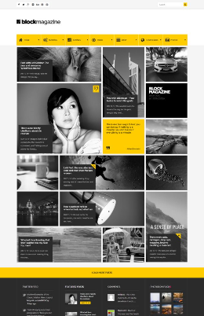
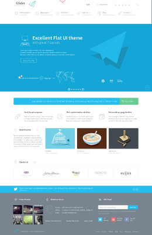
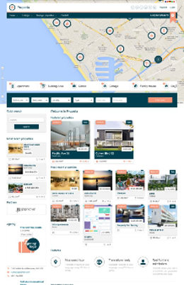

#Exercício 01

Escolha um dos _layouts_ logo abaixo para codificar.

 
 
 
  
	
[voltar para tela inicial](https://github.com/gustavomathias/bighouseweb/blob/master/README.md)

Qualquer dúvida, entre em contato pelo e-mail gustavo.soares@bighouseweb.com.br, com o assunto "vaga programador". _*se aspas_
